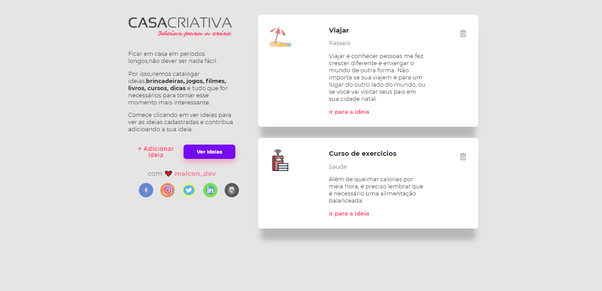
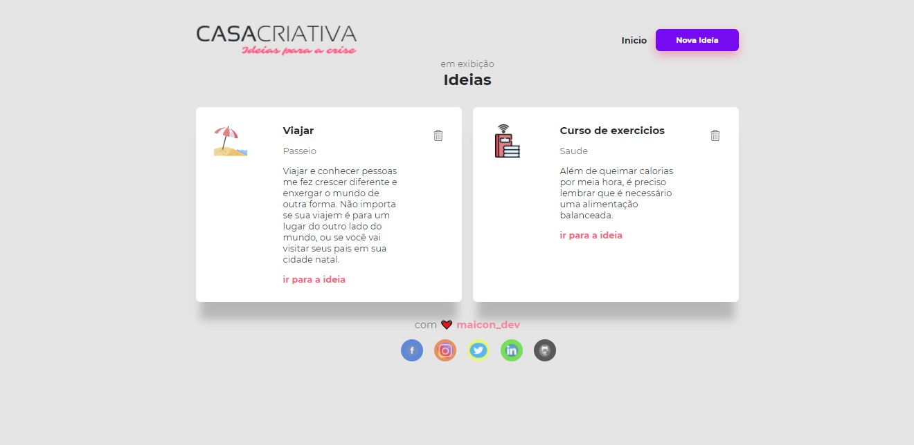
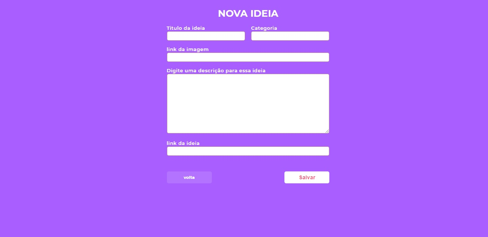

<h2 align="center">

  <br/>
  🚀 WorkshopDev Especial / Casa Criativa - Rocketseat
</h2>

<h4 align="center">
    
</h4>

###### <p align="center">Aplicação foi feita para adicionar ou ver ideias, brincadeiras, jogos, filmes, livros, cursos, dicas para sair da CRISE .</p>

<p align="center">
  <a href="#rocket-Tecnologias">Tecnologias</a>&nbsp;&nbsp;&nbsp;|&nbsp;&nbsp;&nbsp;
  <a href="#information_source-Dependencias">Dependencias</a>&nbsp;&nbsp;&nbsp;|&nbsp;&nbsp;&nbsp;
  <a href="#-front-end">Front-end</a>
</p>

### :rocket: Tecnologias e Ferramentas

- [Node.js](https://nodejs.org/en/)
- [SQLite](https://www.sqlite.org/index.html)
- [Express](/)
- [Nodemon](/)

### :information_source: Dependencias

###### É só fazer as instalações das dependencias com npm 

```
npm install 
```

## 💻 Front-end

<p align="center">
  
  
  
  
  
</p>

###### Home-Page

<p align="center">
    
</p>

###### Ver ideias

<p align="center">
    
</p>

###### Cadastro de ideias

<p align="center">
    
</p>

Feito com 💜 by Maicon Santana 🤝 [Entre em Contato!](https://www.linkedin.com/in/maicon-deivid-b429a81b0)

